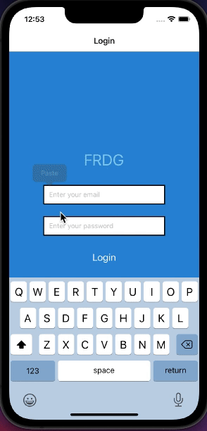

# FRDG

FRDG is a react-native app that allows users to add items to their 'fridge' and track how long until they expire.

<strong> Basic App Functionality </strong>
 

# Technologies Used
- React Native
- Expo
- Postgres w/ Sequelize
- Node
- Express
- Babel
- Axios
- Redux
- JWT
