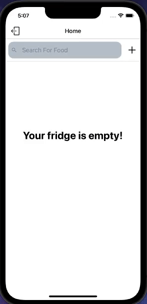
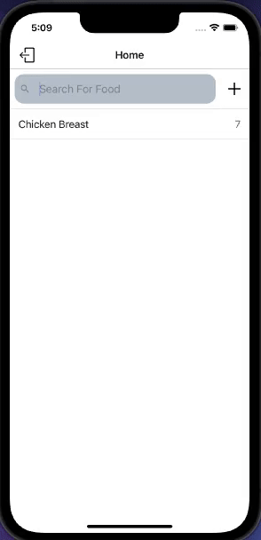

# FRDG

FRDG is a react-native app that allows users to add items to their 'fridge' and track how long until they expire.

#Functionality
<strong> Sign Up </strong>
 

 
 
<strong> Login/Logout </strong>
 

 
 
<strong> Add/Delete </strong>
 

 
 
<strong> Custom Items </strong>
 

 

# Technologies Used

- React Native
- Expo
- Postgres w/ Sequelize
- Node
- Express
- Babel
- Axios
- Redux
- JWT
